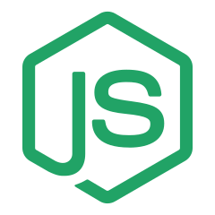

<!--suppress HtmlDeprecatedAttribute -->
# Hello! 👋 Who am I? #

 
- 🔭 Full-stack developer with 3+ years of experience designing and building scalable, high-performance applications 
- 🌱 Proficient in front-end technologies like React JS, Ionic, as well as back-end technologies like Node.js, Python, Flask, FastAPI, Django 
- 👠Experienced in DevOps, CI/CD, and Cloud infrastructure, especially with Azure and GCP also AWS 
- 🢠Currently working at <a href="https://github.com/settyl">Settyl</a> and <a href="https://github.com/sarfaraj-settyl">Sarfaraj-Settyl</a> is my company github 
- 😠Developed some AI Apps and integrated with web, some workflow automation app and many more random things I like. 
- 😉 I've got some knowledge of ML and DL with tensorflow and I'm currently learning pytorch 

 

# Main Skills #

 

# 💻 Additional tools and technologies

<table align="center">
  <tr>
    <td align="center" width="96">
        
       React
    </td>
    <td align="center" width="96">
        
       Python
    </td>
    <td align="center" width="96">
        
       JavaScript
    </td>
      <td align="center" width="96">
        
       Django
      </td>
       <td align="center" width="96">
        
       Pytorch
    </td>
      <td align="center" width="96">
        
       Tensorflow
    </td>
    <td align="center" width="96">
        
       Nodejs
      </td>
    <td align="center" width="96">
        
       TypeScript
    </td>
    <td align="center" width="96">
        
       Azure
    </td>
  </tr>
  <tr>
   <td align="center" width="96">
        
       Webpack
    </td>
    <td align="center" width="96">
        
       Github
    </td>
    <td align="center" width="96"> 
        
       Git
    </td>
    <td align="center"  width="96">
        
       GCP
    </td>
    <td align="center"  width="96">
        
       HTML5
    </td>
    <td align="center" width="96">
        
       CSS
    </td>
   <td align="center" width="96">
        
       Sass
    </td>
    <td align="center" width="96">
        
       Langchain
    </td>
     <td align="center" width="96">
        
       PostgreSQL
    </td>
  </tr>
 <tr>
      <td align="center" width="96">
        
       MongoDB
    </td>
    <td align="center" width="96">
        
       MySQL
    </td>
      </td>
    <td align="center" width="96">
        
       Java
    </td>
            <td align="center" width="96">
        
       VsCode
    </td>
              <td align="center" width="96">
        
       Clickhouse
    </td>
   <td align="center" width="96">
        
       C++
    </td>
     <td align="center" width="96">
        
       AWS
    </td>
             
  
 </tr>
</table>
  

    

    

### Contribution graph
<!-- activity graph heroku-app start -->

    

<!-- activity graph heroku-app end -->

    

### At Sarfaraj Settyl
<!-- activity graph heroku-app start -->

    

<!-- activity graph heroku-app end -->

    

# Do you want to see my past work?

    <h2><a href="https://github.com/sarfarajansari/edutube?tab=readme-ov-file#edutube-">Edutube 🎓📺</a></h2>
    
<strong>Edutube</strong> is an innovative educational platform designed to make learning more interactive and accessible through YouTube videos.

    <video width="100%" controls>
        <source src="https://github.com/user-attachments/assets/cdbd1afa-cc41-4427-b102-98396bede21c" type="video/mp4">
        Your browser does not support the video tag.
    </video>

    <h2><a href="https://github.com/sarfarajansari/legalSphere.Web?tab=readme-ov-file#legalsphere-%EF%B8%8F">LegalSphere ⚖️</a></h2>
    
<strong>LegalSphere</strong> is an AI-driven research engine designed to provide in-depth legal case analysis.

    <video width="100%" controls>
        <source src="https://github.com/user-attachments/assets/fda8f169-9176-4aa7-9e1a-26fb93d99157" type="video/mp4">
        Your browser does not support the video tag.
    </video>

<!-- Repeat for other projects -->

## [Edutube 🎓📺](https://github.com/sarfarajansari/edutube?tab=readme-ov-file#edutube-)

**Edutube** is an innovative educational platform designed to make learning more interactive and accessible through YouTube videos. It provides a structured way to learn subjects, topics, and concepts, transforming passive video watching into an engaging, hands-on experience. With Edutube, users can dive deeper into educational content, get critical insights, and interact with concepts in real time.

https://github.com/user-attachments/assets/cdbd1afa-cc41-4427-b102-98396bede21c

## [LegalSphere ⚖️](https://github.com/sarfarajansari/legalSphere.Web?tab=readme-ov-file#legalsphere-%EF%B8%8F)

**LegalSphere** is an AI-driven research engine designed to provide in-depth legal case analysis. With an **advanced Retrieval-Augmented Generation (RAG) model** and a suite of visualization tools, LegalSphere enables users—especially legal professionals and researchers—to gain a comprehensive understanding of a case’s strengths, weaknesses, supporting evidence, and other crucial details within seconds.

https://github.com/user-attachments/assets/fda8f169-9176-4aa7-9e1a-26fb93d99157

## [Garbage Redressal System](https://github.com/sarfarajansari/garbageRedressal?tab=readme-ov-file#garbage-redressal-system)
The **Garbage Redressal System** is an React application that enables people to report waste management issues by submitting photos. Using an image analysis model, the system validates whether the submitted request is genuine and automatically provides the location coordinates if garbage is detected in the images. The system features role-based access for admins and staff to manage and resolve these issues efficiently.

https://github.com/user-attachments/assets/6533b2f7-19f2-4738-986b-7a2ac28e3e96

## [Human Detection Model Deployment](https://github.com/sarfarajansari/human-detection-model-deployment?tab=readme-ov-file#human-detection-model-deployment)

This repository contains the deployment setup for a human detection model built by the AI club in my college. My role in this project was to to deploy the model with a user-friendly Streamlit interface for easy interaction.

https://github.com/user-attachments/assets/dacc8fbe-96cc-4757-afee-e14c8d9a8064

## [Marvelous Ludo](https://github.com/sarfarajansari/ludo?tab=readme-ov-file#marvelous-ludo)

**Marvelous Ludo** is a fun, superhero-themed twist on the classic Ludo game! Inspired by my love for Marvel, this game brings iconic Marvel characters into the gameplay, making it an exciting choice for fans. Select your favorite Marvel heroes and dive into an adventurous game of Ludo!

https://github.com/user-attachments/assets/27095ba3-ad4c-47ae-87f2-cc3c21c81087

## [Visual Voice 🗣️🎥](https://github.com/sarfarajansari/visualvoice?tab=readme-ov-file#visual-voice-%EF%B8%8F)

**Visual Voice** is an inclusive platform specifically designed for **deaf and hard-of-hearing individuals**. The platform allows users to upload videos without transcripts, automatically generating accurate transcripts for the video. During playback, users can view large, clear subtitles and interactive, colorful sticky notes that highlight key topics discussed in the video. 

Visual Voice aims to bridge communication gaps and provide a more accessible, interactive learning and entertainment experience.

https://github.com/user-attachments/assets/e49b639a-b48a-4d04-b3c7-dcfd4c17479a

## [The Awesome Store 🛒](https://github.com/sarfarajansari/Ecommerce?tab=readme-ov-file#the-awesome-store-)

**The Awesome Store** is a full-featured **Ecommerce web application** built using **React** for the frontend and **Django** for the backend. This project combines user-friendly UI and powerful backend functionality to create a seamless shopping experience.

https://github.com/user-attachments/assets/3f3a8e96-0d03-414b-a2ab-a0817c95c4a8

## [ Gauss Elimination - Streamlit App 🔢](https://github.com/sarfarajansari/gaussianEliminationANM?tab=readme-ov-file#gauss-elimination---streamlit-app-)

This app implements the **Gauss Elimination** method to solve systems of linear equations of the form \( AX = B \), where \( A \) is a coefficient matrix, \( X \) is the variable matrix, and \( B \) is the result matrix. The app allows users to input matrices for \( A \) and \( B \), and then solves for \( X \) step-by-step using the Gauss Elimination algorithm.

> **Note**: I built this app while learning **Applied Numerical Methods** during my college studies. It was a great way to apply theoretical concepts into a practical tool!

https://github.com/user-attachments/assets/86dc95af-9733-4df8-97a1-4ff32a75ca41

## [ TicTacToe 🎮](https://github.com/sarfarajansari/tictactoe?tab=readme-ov-file#tictactoe-)

This is a **TicTacToe game** built in **React** with a sleek, user-friendly interface. The game includes three difficulty levels—**easy**, **intermediate**, and **unbeatable**—with the unbeatable mode powered by the **minimax algorithm** for a challenging experience.

https://github.com/user-attachments/assets/675eaafc-3377-4b1f-9e52-1ee7a300defa

## [AI Club Website 🌐](https://github.com/sarfarajansari/aiclub?tab=readme-ov-file#ai-club-website-)

I'm excited to share the AI Club Website, which I built using React during my interview process with the AI Club! 🎉 The website was designed to offer a visually stunning and interactive experience, with features like event listings, contact details, and a dynamic carousel to keep things engaging.

https://github.com/user-attachments/assets/f9e95c8e-3fa2-46b3-ab41-fddd41cd4574

## [Drag and Drop React App](https://github.com/sarfarajansari/drag-drop?tab=readme-ov-file#drag-and-drop-react-app)

This repository contains a React application where I implemented a drag-and-drop feature from scratch. The main functionality of the app allows users to drag items and drop them into a shipment container. It was an assignment given to me during my interview process at Settyl, and it helped me demonstrate my proficiency with React, state management, and handling user interactions in a dynamic way.

https://github.com/user-attachments/assets/0bf83a34-fdc0-4bef-9adb-025a1bc99039

## [Blog App 📝](https://github.com/sarfarajansari/Blogs_APP?tab=readme-ov-file#blog-app-)

A **Django-powered blog application** that lets users create, customize, and share their own blogs with a personalized touch. Featuring custom themes, authentication, and a clean UI, this app provides an engaging blogging experience for both writers and readers.

> **Note**: I built this app when I was in 11th grade, diving into the world of Django and front-end design with Bootstrap. This project was my entry point into web development, combining my interests in coding and creative design! Thanks to CS50 where I learnt DJANGO!

https://github.com/user-attachments/assets/5b8ae327-04e5-486a-9c73-ee8c44553d15

## [To-Do App 📝](https://github.com/sarfarajansari/todo?tab=readme-ov-file#to-do-app-)

This is a simple **To-Do app** built in **React**—one of my very first React projects. Although the UI is basic, this project was a great learning experience and helped me get hands-on with React fundamentals.

https://github.com/user-attachments/assets/500827c1-8536-4271-a262-7f707ca8f684

## [Streamlit Todo App](https://github.com/sarfarajansari/streamlit-todo-app?tab=readme-ov-file#streamlit-todo-app)

This is a simple Todo app built with Streamlit. I created this project as an introduction to Streamlit, exploring its capabilities for building interactive, data-driven applications. The app provides a straightforward interface for managing tasks, allowing users to add, update, and delete items on their todo list.

https://github.com/user-attachments/assets/a118c87d-0247-42e7-9389-44e965149fc1

# Reach out to me #

  
  

